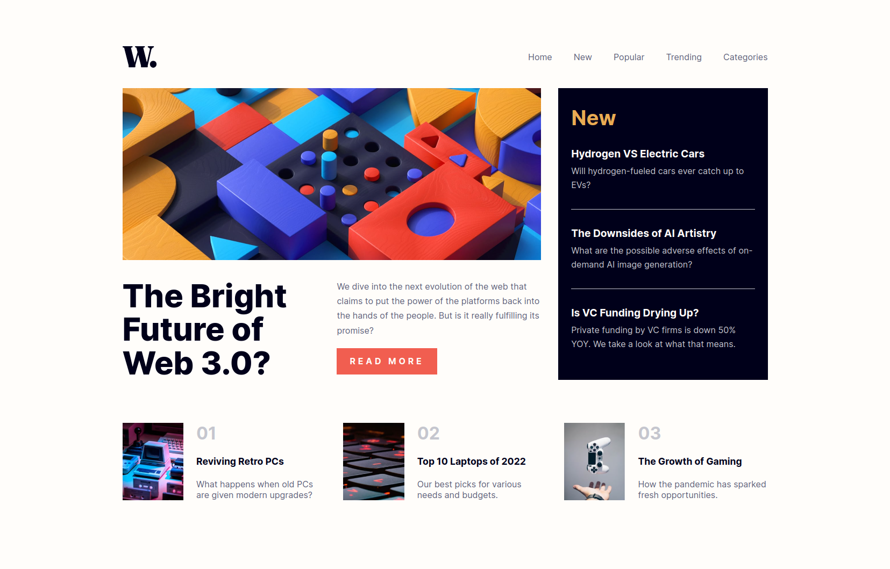

# Frontend Mentor - News homepage solution

This is a solution to the [News homepage challenge on Frontend Mentor](https://www.frontendmentor.io/challenges/news-homepage-H6SWTa1MFl). Frontend Mentor challenges help you improve your coding skills by building realistic projects. 

## Table of contents

- [Overview](#overview)
  - [The challenge](#the-challenge)
  - [Screenshot](#screenshot)
  - [Links](#links)
- [My process](#my-process)
  - [Built with](#built-with)
  - [What I learned](#what-i-learned)
- [Author](#author)

## Overview
A Homepage challenge from frontendmentor.io

### The challenge

Users should be able to:

- View the optimal layout for the interface depending on their device's screen size
- See hover and focus states for all interactive elements on the page

### Screenshot

### Links

- Solution URL: [Source code on Github](https://github.com/MikeyOnyedika/news-homepage-FEMC)
- Live Site URL: [News Homepage FEMC](https://news-homepage-femc.vercel.app/)

## My process

### Built with
- Semantic HTML5 markup
- CSS custom properties
- Flexbox
- CSS Grid
- Mobile-first workflow

### What I learned

In this exercise, I started exploring BEM convention in writing css classes

## Author

- Website - [victor](https://victor-onyebuchi.vercel.app/)
- Frontend Mentor - [@MikeyOnyedika](https://www.frontendmentor.io/profile/MikeyOnyedika)
- Twitter - [@Mikey24820494](https://www.twitter.com/Mikey24820494)
